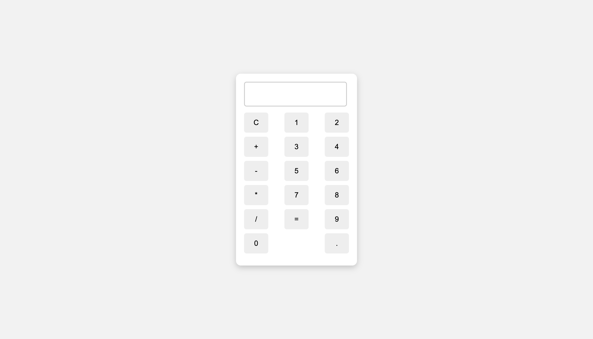

# 🧮 Basic Calculator Web App
This is a simple calculator web application built using **HTML**, **CSS**, and **JavaScript**. It allows users to perform basic arithmetic operations like addition, subtraction, multiplication, and division. The project is designed as a beginner-friendly exercise for learning front-end development.

## ✨ Features
- Responsive and clean UI
- Perform basic operations: `+`, `-`, `*`, `/`
- Supports decimal numbers
- `C` button to clear input
- `=` button to calculate result
- Instant interaction using mouse clicks

Made with 💻 by Bikram Saha
